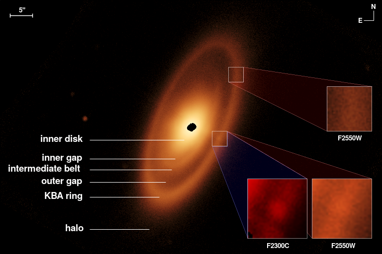
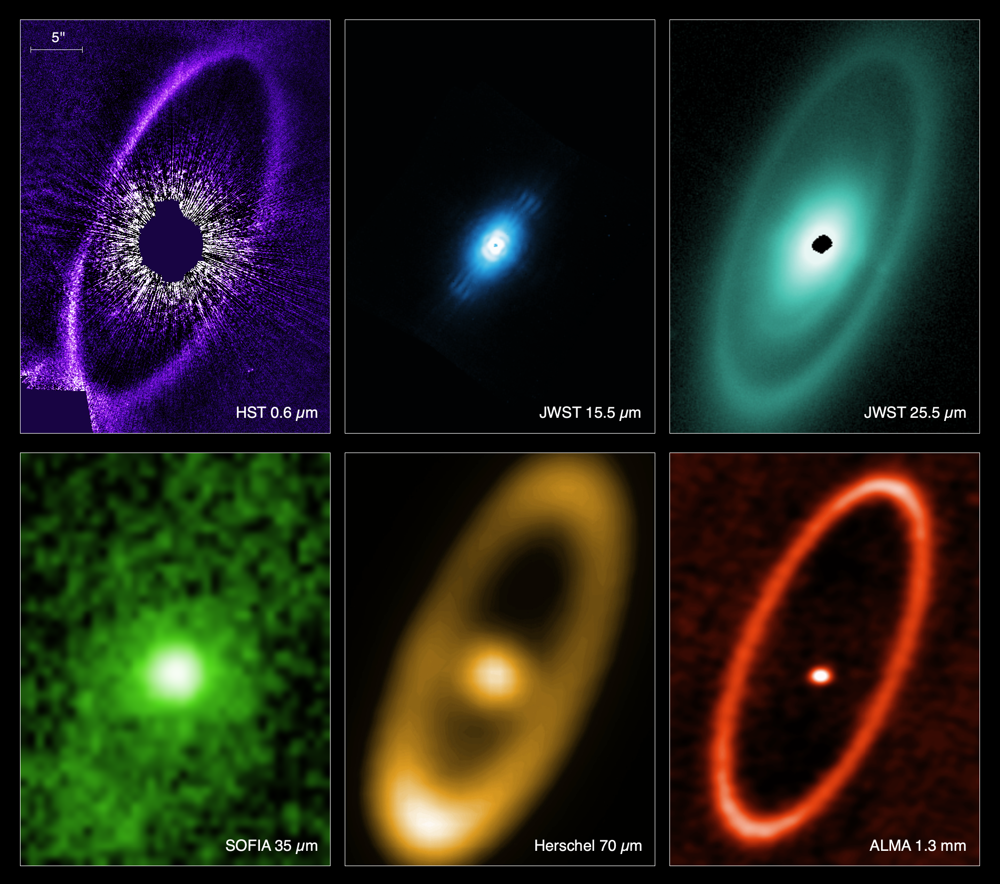
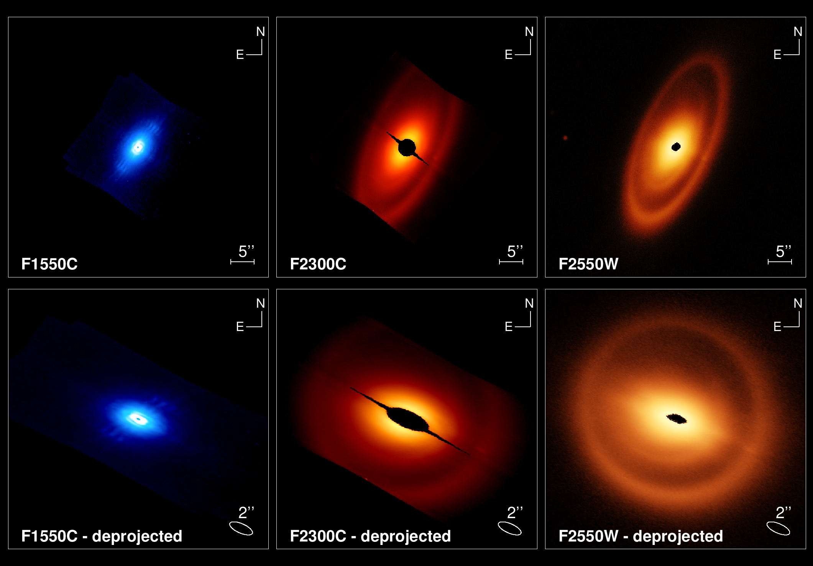
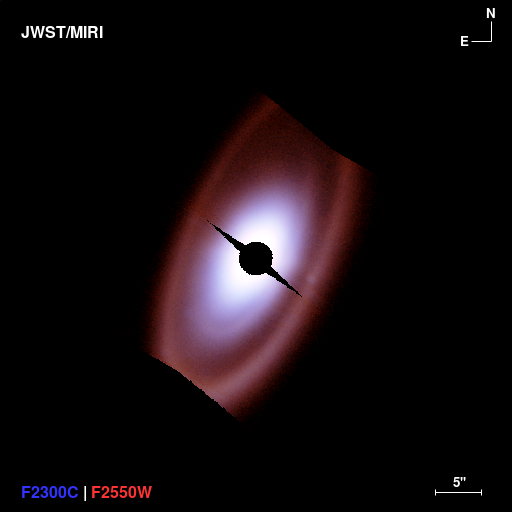
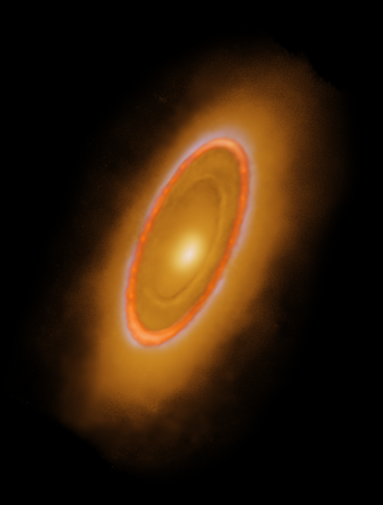
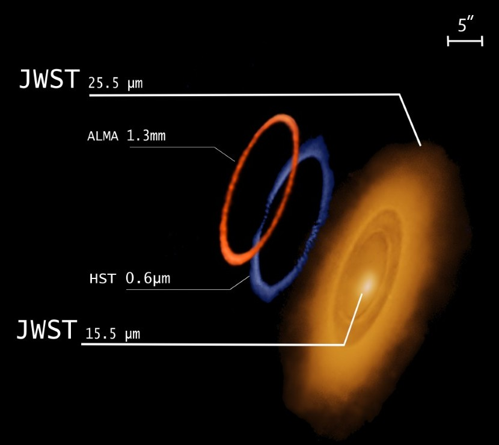
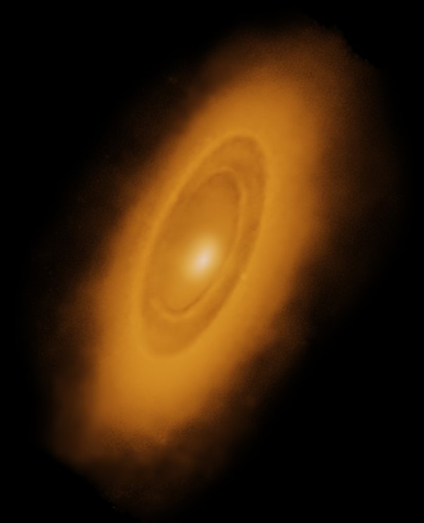

# JWST/MIRI Fomalhaut images

Archive of our recently published JWST/MIRI images of the Fomalhaut Debris Disk system (nature link).
We provide the final reduced FITS images (with or without distortion correction) as well as figures
and presentation quality images.

## Labeled 25.5 micron image

This image highlights the various components identified in the 25.5 micron MIRI image

## Gallery

In this image, we present a gallery of the system, showcasing the best available images at various wavelengths

## Deprojected images

Here, we show how the system would appear as if viewed face-on utilizing orbit fitting to determine the inclination and position angle of the system.

## 23/25 color image

This is a color image, produced using the 23.0 and 25.5 micron observations

## Enhanced images

Courtesy of Adam Block, we also have ehnanced images that showcase how the system would likely look with higher SNR observations. 
The first image combines available HST, JWST/MIRI, and ALMA observations

The second image separates the components shown in the previous image. This should be helpful for explaining what we are seeing.

While the third image highlights only the MIRI observations (15.5 and 25.5 combined and ehanced).

## FITS images

FITS images are provided at 15.5, 23.0, and 25.5 micron. The images are in MJy/sr flux units and absolute 
flux calibrated following the methods described in our paper. For the 23 and 25.5 micron observations, we 
also provide distortion corrected solutions. The distortion is negligible (less than 1.5 px) even at
23 and 25.5 microns and practically non-existent in the small field-of-view of the 15.5 micron dataset.

